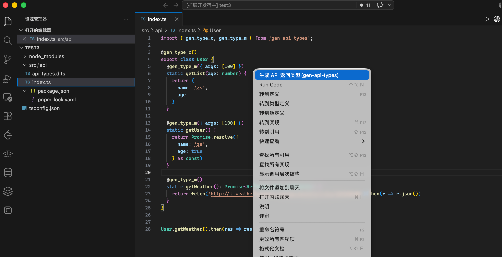

# gen-api-types

#### 介绍

🚀 一个自动生成请求接口返回类型的 cli 小工具

在 ts 项目中，经常需要编写接口返回类型。但是每次都要查看接口文档，手动编写非常麻烦。如果遇到一些第三方接口或者接口文档不全的情况，还需要先调试接口后，再编写接口返回类型，很令人头疼

借助这个工具，我们可以通过 ts 装饰器来标记请求接口的类和方法，然后动态调用这些接口，并将接口返回的数据转换成 ts 类型文件，这样我们就可以在项目中直接使用了

> 注意：
>
> 1. 由于需要使用到ts装饰器特性，而装饰器目前（ts 5.0）不支持直接标记普通函数，所以我们的接口必须以 **接口类+静态api方法** 的形式书写
> 2. 该工具需要动态执行 ts 代码（import接口类，然后调用标记的静态api方法），因此会通过内置依赖的 `tsx` 执行工具运行，无需额外全局安装 `tsx`。

#### 安装教程

1.npm 安装

```shell
npm install gen-api-types -D

```

#### 使用说明

##### 1. 标记接口类名和方法

```ts
import { gen_type_c, gen_type_m } from 'gen-api-types'

@gen_type_c()
export class TestApi {
	@gen_type_m({ args: [100], typeName: 'XXX' })
	static async getList(id: number): Promise<XXX> {
		return asleep(1000).then(() => {
			return { name: 'zs', id }
		})
	}

	@gen_type_m()
	static getWeather(): Promise<Response_TestApi_getWeather> {
		return fetch('http://t.weather.sojson.com/api/weather/city/101030100').then(r => r.json())
	}
}
```

如上面代码所示:

- `@gen_type_c`装饰器函数，用来标记接口类。因为工具会动态分析指定目录下的所有 ts 文件，标记接口类，可以帮助我们快速定位接口类
- `@gen_type_m`装饰器函数标记需要转换的请求方法。它可以接收一个配置对象，包含两个字段。
  1.  `typeName: string` 接口返回类型名称，若不指定该字段，默认生成名称为： `Response_${类名}_${方法名}`
  2.  `args：any[] ` 方法参数列表,工具调用请求方法时，会将参数列表传入

> 注意：

若使用装饰器时ts报错: "运行时将使用 2 个自变量调用修饰器，但修饰器需要 3 个",请将tsconfig中`compilerOptions.experimentalDecorators`设置为`true`

##### 2. 执行命令

```shell
npx gen-api-types  -o output_dir -O output_file_name ./api_dir1 ./api_dir2
```

参数说明：

```shell
 Usage: npx gen-api-types [options] [api_dirs...]

Options:
  -h, --help                  输出帮助信息
  -r, --project_root <path>   项目根目录
  -O, --output_file <path>    输出文件名
  -o, --output_dir <path>     输出目录
  -t, --ts_config_path <path> tsconfig.json 文件路径
  --isExported                生成导出的类型声明
```

当然，也可以通过配置 package.json 中的 scripts 来使用

```json
{
	"scripts": {
		"gen_types": "gen-api-types -o output_dir -O output_file_name ./api_dir1 ./api_dir2"
	}
}
```

命令输出：

```shell
🚀 开始生成API类型...
sourceFilesGlob [ 'src\\**\\*.ts' ]
📋 处理 TestApi.getList ...
📋 处理 TestApi.getWeather ...
请求结果：
  ┌────────────────┬──────────────────────────────────────┐
  │ (index)        │ Values                               │
  ├────────────────┼──────────────────────────────────────┤
  │ ✔️ successList │ 'TestApi.getList TestApi.getWeather' │
  │ ❌ errorList   │ ''                                   │
  └────────────────┴──────────────────────────────────────┘
✅ API 类型生成完成
```

##### 3. 使用类型

默认生成类型文件 api-types.d.ts，且类型声明没有导出

```ts
type XXX = { name: string };
type Response_TestApi_getWeather = {...}
```

可在`tsconfig.json`中配置`include`引用

```json
// tsconfig.json
{
	"include": ["api-types.d.ts"]
}
```

或者直接在接口模块文件顶部通过 reference 引用:

```ts
/// <reference path="./api-types.d.ts" />
export class TestApi {
	@gen_type_m()
	static getWeather(): Promise<Response_TestApi_getWeather> {
		return fetch('http://t.weather.sojson.com/api/weather/city/101030100').then(r => r.json())
	}
}

//此时data的类型为Response_TestApi_getWeather
const data = await TestApi.getWeather()
```

如果希望生成可导出的类型声明，可以在执行命令时添加 `--isExported`：

```shell
npx gen-api-types --isExported -o output_dir -O output_file_name ./api_dir1 ./api_dir2
```

生成结果示例：

```ts
export type XXX = { name: string };
export type Response_TestApi_getWeather = {...}
```

#### VS Code 插件

如果你在 VS Code 中使用 `gen-api-types` ，可以安装配套插件 [gen-api-types-vsce](https://github.com/xuejiangping/gen-api-types-vsce)，通过右键菜单生成 API 返回类型。


插件不会内置 CLI，它会调用当前业务项目本地安装的 `gen-api-types`：

安装插件后，在已标记装饰器的 `.ts` / `.tsx` 文件中右键选择 `生成 API 返回类型(gen-api-types)` 即可。插件会默认：

- 将当前 TypeScript 文件所在目录作为 `api_dirs` 参数
- 将类型文件生成到当前 TypeScript 文件同目录
- 使用 `api-types.d.ts` 作为默认输出文件名
- 输出文件已存在时弹出覆盖确认

插件支持在 VS Code 设置中配置 CLI 参数：

| 插件配置项                   | 对应 CLI 参数          | 默认行为                          |
| ---------------------------- | ---------------------- | --------------------------------- |
| `gen-api-types.projectRoot`  | `-r, --project_root`   | 当前 TS 文件所在 workspace 根目录 |
| `gen-api-types.outputFile`   | `-O, --output_file`    | `api-types.d.ts`                  |
| `gen-api-types.outputDir`    | `-o, --output_dir`     | 当前 TS 文件所在目录              |
| `gen-api-types.tsConfigPath` | `-t, --ts_config_path` | 不传，由 CLI 使用默认值           |
| `gen-api-types.isExported`   | `--isExported`         | `false`                           |

插件本质上是对 CLI 的 VS Code 入口封装，类型分析、接口执行和类型文件生成仍由 `gen-api-types` 完成。
